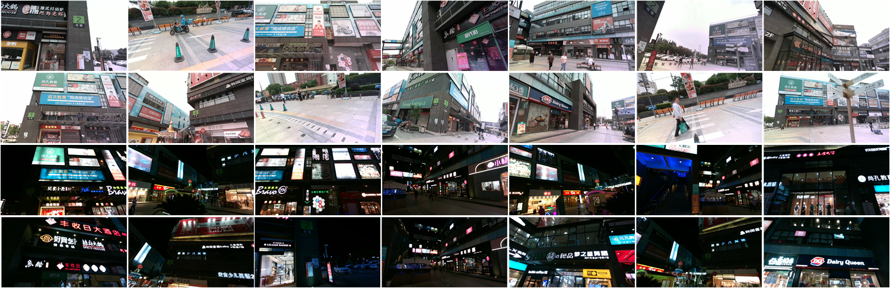
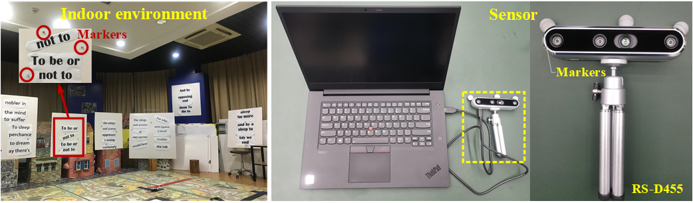
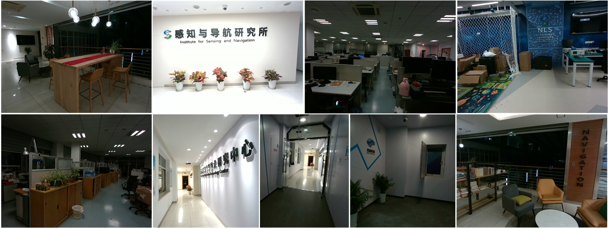
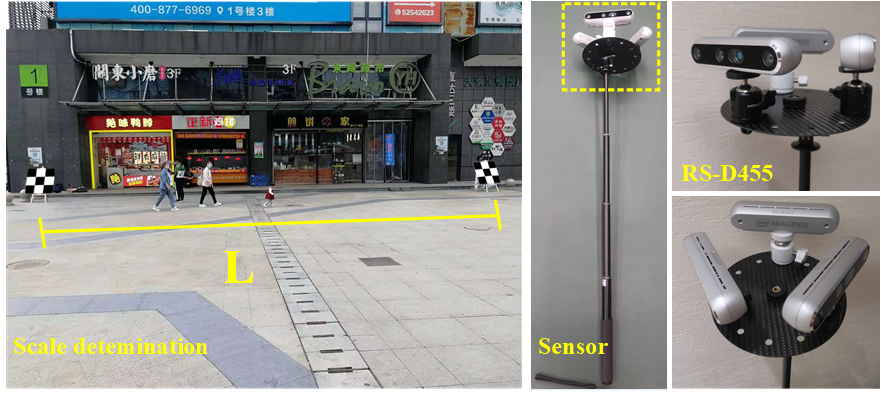

# TextSLAM-Dataset: Text-oriented Semantic Dataset

**Project: TextSLAM: Visual SLAM with Semantic Planar Text Features**

**Authors**: [Boying Li](https://leeby68.github.io/), [Danping Zou](https://drone.sjtu.edu.cn/dpzou/), Yuan Huang, Xinghan Niu, Ling Pei and Wenxian Yu.

🏠 [[Project]](https://leeby68.github.io/TextSLAM/)
&emsp;
📝 [[Paper]](https://ieeexplore.ieee.org/abstract/document/10285400)
&emsp;
🔥 [[Code]](https://github.com/SJTU-ViSYS/TextSLAM/)
&emsp;
🔧 [[Extra Evaluation Tool]](https://github.com/SJTU-ViSYS/SLAM_Evaluation/)

This repository contains **TextSLAM-Dataset**, the Text-oriented Semantic Dataset.

## Overview
:star: TextSLAM-Dataset is **A Robust and Expansive Text-oriented Semantic Dataset covering various real-world scenarios, both indoor and outdoor, accompanied by comprehensive ground truth**:

- This is the **First** Text-oriented dataset for SLAM method. <br>
- Cover diverse **Indoor and Outdoor** scenes, including **Rich Scene Texts** with various sizes, fonts, languages, and backgrounds. <br>
- Cover real-world complex environments with **Rich Semantic Objects** and multiple challengings, such as **complex occlusion**, **glass reflection**, **dynamic pedestrians**, and **illumination changes**. <br>
- Provide **Pose and Mapping Ground Truth** with high precision. <br>
- Provide **Image Retrieval Ground Truth** for **Day-Night** sequence, serving as a valuable resource for **Visual Localization** tasks. <br>

:star: **Dataset Overview:**
- Comprise a total of **36 sequences** covering a mix of indoor and outdoor scenes.
- Utilizing the depth-camera [Intel RS-D455](https://www.intelrealsense.com/depth-camera-d455/) for data collection.
- Provide text extraction results within sequences for fair comparisons. The text detection and recognition results in this paper are from [AttentionOCR](https://github.com/zhang0jhon/AttentionOCR). Note that more advanced text extractors can be integrated if they are available.
- Refer [our paper](https://ieeexplore.ieee.org/abstract/document/10285400) to find the performance of state-of-the-art SLAM algorithms in this dataset.

<div align="center">
<br>
<em>Overview of TextSLAM dataset (outdoor)</em>
</div>
&emsp; 

<div align="center">
<br>
<em>Overview of TextSLAM dataset Ground truth (outdoor)</em>
</div>
&emsp; 

Our **accompanying videos** are now available on YouTube (click below images to open) and Bilibili<sup>[1-outdoor](https://www.bilibili.com/video/BV1pe411B7kx/?spm_id_from=333.999.0.0&vd_source=404d99588f2e4c0ce1cca75ed492e620), [2-night](https://www.bilibili.com/video/BV1kC4y1M7tk/?spm_id_from=333.999.0.0&vd_source=404d99588f2e4c0ce1cca75ed492e620), [3-rapid](https://www.bilibili.com/video/BV1Au4y1T7DE/?spm_id_from=333.999.0.0&vd_source=404d99588f2e4c0ce1cca75ed492e620)</sup>.
<div align="center">
<a href="https://youtu.be/ug-FvJKTXJY" target="_blank"></a>
<a href="https://youtu.be/PYrZ5kiIC0Q" target="_blank"></a>
  <a href="https://youtu.be/3Ml6070Hgd8" target="_blank"></a>
</div>

:star: Please consider citing the following papers in your publications if the project helps your works.
```
@article{li2023textslam,
  title={TextSLAM: Visual SLAM with Semantic Planar Text Features},
  author={Li, Boying and Zou, Danping and Huang, Yuan and Niu, Xinghan and Pei, Ling and Yu, Wenxian},
  booktitle={IEEE Transactions on Pattern Analysis and Machine Intelligence (TPAMI)},
  year={2023}
}

@inproceedings{li2020textslam,
  title={TextSLAM: Visual SLAM with Planar Text Features},
  author={Li, Boying and Zou, Danping and Sartori, Daniele and Pei, Ling and Yu, Wenxian},
  booktitle={IEEE International Conference on Robotics and Automation (ICRA)},
  year={2020}
}
```

# Dataset Download

We provide sequences according to their collection scenes respectively.
In the Download Table, the 'All' link allows users to download all the data within a single sequence. Additionally, individual item download links ('Images', 'Texts', 'Ground Truth', 'Image List') are provided in the following columns.

## A. Indoor Scene Download
<div align="center">
<br>
<em>Overview of Indoor Environment & Sensors</em>
</div>
&emsp; 

:arrow_right: **Indoor sequences (10 sequences) : [BaiduYun Link](https://pan.baidu.com/s/1ZI7wntHbP-P4_BSvgiCBnw?pwd=bstw)**  <br>
Refer to `yaml/GeneralMotion.yaml` in [TextSLAM algorithm](https://github.com/SJTU-ViSYS/TextSLAM/) and Table-2 in [our paper](https://ieeexplore.ieee.org/abstract/document/10285400). <br>


:arrow_right: **Indoor sequences for loop test (8 sequences): [BaiduYun Link](https://pan.baidu.com/s/1hWJmZL5s1RMK9THRnCDNHw?pwd=4pfh)**  <br>
Refer to `yaml/AIndoorLoop.yaml` in [TextSLAM algorithm](https://github.com/SJTU-ViSYS/TextSLAM/) and Table-4 in [our paper](https://ieeexplore.ieee.org/abstract/document/10285400). <br>

## B. Large Indoor Scene Download

<div align="center">
<br>
<em>Large Indoor Environment</em>
</div>
&emsp; 

:arrow_right: **Large Indoor sequences for loop test (9 sequences): [BaiduYun Link](https://pan.baidu.com/s/1Q_Xx7C1pzlhr0Aet_mwaFg?pwd=wibj)**  <br>
Refer to `yaml/LIndoorLoop.yaml` in [TextSLAM algorithm](https://github.com/SJTU-ViSYS/TextSLAM/) and Table-5 in [our paper](https://ieeexplore.ieee.org/abstract/document/10285400). <br>

## C. Outdoor Scene Download

<div align="center">
<br>
<em>Outdoor Environment & Sensors</em>
</div>
&emsp; 

:arrow_right: **Day Sequences (8 sequences): [BaiduYun Link](https://pan.baidu.com/s/1W1FCzO4MMFqxkfg8Sv17hw?pwd=4kwf)**  <br>
Refer to `yaml/Outdoor.yaml` in [TextSLAM algorithm](https://github.com/SJTU-ViSYS/TextSLAM/) and Table-6 in [our paper](https://ieeexplore.ieee.org/abstract/document/10285400). <br>

:arrow_right: **Night Sequences (1 sequence): [BaiduYun Link](https://pan.baidu.com/s/12GkXY6u1H4tZRrTnwfx3WA?pwd=cwcy)**  <br>
Refer to Figure-23 in [our paper](https://ieeexplore.ieee.org/abstract/document/10285400). <br>

<!-- File Structure -->

## **Notation:**

The structure of each file is as follows:
```
<Sequence name>
│
├── <images>
├────────	[timestamp].png
├──────── .......
├── <text>
├────────	[timestamp]_dete.txt		   // detection result for [timestamp].png. Each line: u1,v1,u2,v2,u3,v3,u4,v4
├────────	[timestamp]_mean.txt		   // recognition results for [timestamp].png. Each line: meaning, confidence
├──────── .......
├── <Exper.txt>                      		  // image list for this sequence
├── <gt.txt>                         		  // Each line (TUM format): timestamp tx ty tz qx qy qz qw
<Intrinsic Parameters>          		  // First line: fx, fy, cx, cy; Second line: k1, k2, p1, p2, k3
```

For night sequence:
```
<match_gt.txt>                     		  // Each line: [night_image_name].png [matched day_image_name].png
```
Specifically, the `[matched day_image_name].png` is from `Seq_02` in the `4_Outdoor` sequences.


# License
TextSLAM-Dataset is licensed under a CC BY-NC-SA 4.0 License, which is released for non-commercial research purpose only.

